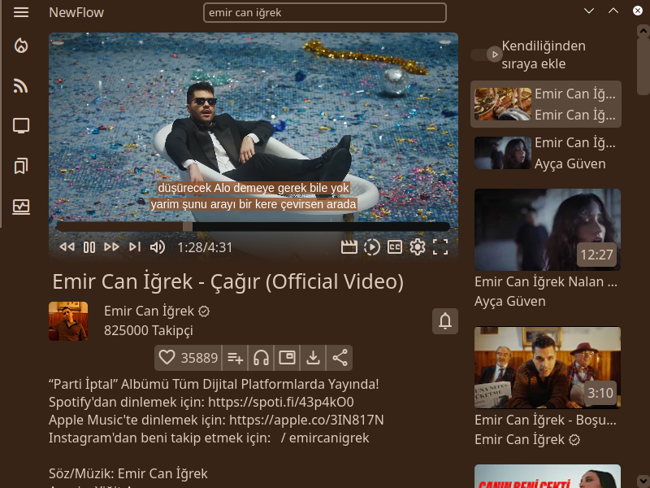

# NewFlow 



Your free video player client for YouTube™.

> You can see more screenshots from [Gallery](./assets/screenshots/GALLERY.md)

> [!WARNING]
> This application is unstable, there are still a lot of missing or partially implementated features however most of core features should work.

## Installation

> [!WARNING]
> Installers is designed to help end users while installing NewFlow however the installers can have some bugs. If you encounter if any bug, please report it.

### For Windows 10 and above

> You can use the installer that placed in releases section.

### For Linux

> You can run the command that placed below to install NewFlow.

> [!IMPORTANT]
> `git` and `electron` commands must be installed to use the script.

```curl https://raw.githubusercontent.com/malisipi/NewFlow/main/linux-setup | bash```

## Licenses

> [!IMPORTANT]
> The application is licensed by [Apache 2.0 License](./LICENSE).
>
> The icons and banners of application is licensed by [Attribution-NonCommercial-NoDerivatives 4.0 International License](./LICENSE_CC_BY_NC_ND_4.0). So `./assets/banner.png`, `./assets/newflow.png`, `./assets/newflow.ico` and `./assets/newflow.svg` is licensed by [Attribution-NonCommercial-NoDerivatives 4.0 International License](./LICENSE_CC_BY_NC_ND_4.0)

- [Electron.JS](https://github.com/electron/electron) is licensed by [MIT License](https://github.com/electron/electron/blob/main/LICENSE).
- [electron/remote](https://github.com/electron/remote) is licensed by [MIT License](https://github.com/electron/remote/blob/main/LICENSE).
    - Module placed in `./node_modules/@electron/remote`.
- [Yaru Icons](https://github.com/ubuntu/yaru) is licensed by [CC-BY-SA 4.0 License](https://github.com/ubuntu/yaru#copying-or-reusing).
    - Icons placed in `./assets/yaru-icons/`.
- [Breeze Icons](https://github.com/KDE/breeze-icons) is licensed by [LGPL 2.1 License](https://github.com/KDE/breeze-icons/blob/master/COPYING.LIB).
    - Icons placed in `./assets/breeze-icons/`.
- [Fluent Icons](https://github.com/microsoft/fluentui-system-icons) is licensed by [MIT License](https://github.com/microsoft/fluentui-system-icons/blob/main/LICENSE).
    - Icons placed in `./assets/fluent-icons/`.
- [Bootstrap Icons](https://github.com/twbs/icons) is licensed by [MIT License](https://github.com/twbs/icons/blob/main/LICENSE).
    - Icons placed in `./assets/bootstrap-icons/`.
- [Material Symbols](https://github.com/google/material-design-icons) is licensed by [Apache 2.0 License](https://github.com/google/material-design-icons/blob/master/LICENSE).
    - Icons placed in `./assets/material-symbols/`, `./fonts/material-symbols-rounded.woff2` and `./css/material-symbols.css` (Edited).
- [yt-extractor.js](https://github.com/malisipi/yt-extractor.js) is licensed by [Apache 2.0 License](https://github.com/malisipi/yt-extractor.js/blob/main/LICENSE).
    - Sub dependencies:
        - [fast-xml-parse](https://www.npmjs.com/package/fast-xml-parser) is licensed by [MIT License](https://github.com/NaturalIntelligence/fast-xml-parser/blob/master/LICENSE).
- [node-vibrant](https://github.com/Vibrant-Colors/node-vibrant) is licensed by [MIT License](https://github.com/Vibrant-Colors/node-vibrant/blob/master/LICENSE.md).
    - Script file placed in `./js/thirdparty/vibrant.js`.
- [hls.js](https://github.com/video-dev/hls.js) is licensed by [Apache 2.0 License](https://github.com/video-dev/hls.js/blob/master/LICENSE).
    - Script file placed in `./js/thirdparty/hls.light.min.js`.

## FAQ

### Picture-in-Picture gets under windows on Linux/Wayland

Since Wayland protocol doesn't support to set windows always on top, there're no possible way to do it without a Window-Manager trick.

* If you're using KWin Windows Manager (Default Windows Manager of KDE Desktop Environment), you can set a new window rule to keep on top.

* If you're using Ubuntu or based distro, you can look up [this extension](https://github.com/Rafostar/gnome-shell-extension-pip-on-top) to get working.

### Windows 7 Support

There're no official support for Windows 7, however it can work with some tricks.

> [!CAUTION]
> Don't forget there's no support for Windows 7. And using any trick to make the application working, the application can be crash randomly times. Also it can cause security bugs.

* You can try with [Supermium Electron](https://github.com/win32ss/supermium-electron). It's port of Electron for Windows 7.

### Creating Desktop Shortcut on Linux with Wayland Support

```
NEWFLOW_FLAGS="--enable-features=UseOzonePlatform --ozone-platform=wayland" ./scripts/install-desktop-file
```